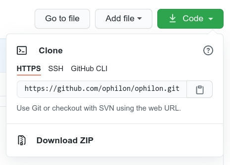

## лабораторная работа №4

### *возможности github для коллективной работы*

*цель работы* — ознакомиться с сервисом хранения текстовых файлов —
документов,  программ, контроль версий, ветки (branches) в репозитарии,
роли и разграничение прав, клонирование, обновление локального
хранилища файлов, загрузка обновлений в общий проект

Создав ваш новый персональный сайт в предыдущей лабораторной
работе вы фактичестки уже познакомились с сервисом гитхаб. Пока
что работа с репозитарием велась только через браузер, редактирую
страницы во встроенном редакторе. Также мы не пытались настроить
какой-либо совместный доступ к репозитарию. Настоящие преимущества
сервиса гитхаб раскрываются при коллективной работе. Гитхаб
и соответствующий клиент под названием git на вашем компьютере
позволит работать над проектом локально, в привычном редакторе на
собственном компьютере, синхронизировать локальное содержимое с
репозитарием на гитхабе, хранить историю всех изменений, создавать
т. н. ветви (branches) в больших проектах. Например, программисты создают
такой набор ветвей — development для активно обновляемой версии, testing
для тестируемой и production для загрузки (deploy) на основной сервер. Для
обновлений и безопасности программ существуют процессы review и pull
request (PR). Для этих процессов настраивают соответствующие полномочия,
кто отвечает и имеет право включать правки в какую из ветвей.

Все эти полномочия привязаны к профилю пользователя гитхаб. Профиль,
как обычно, привязан к аккаунту гугл и имеет множество настроек:

    - Your profile
    - Your repositories
    - Your projects
    - Your stars
    - Your gists
    - Upgrade
    - Feature preview
    - Help
    - Settings

Все возможности гитхаб выходят за рамки нашего курса, но
основные возможности мы обсудим. Во-первых, мы используем в наших
проектах только бесплатно предоставляемые ресурсы. Опция Upgrade
позволит перейти на платную версию, если вдруг понадобится что-то
особенное. Более подробно о платных возможностях рассказано здесь:
<https://github.com/organizations/plan>

Мы выбрали опцию Public при создании проекта. Это значит из любого
браузера для любого пользователя ваши страницы доступны в
отформатированном виде, что и надо для персонального сайта. Всё
содержимое сайта будет доступно также пользователям гитхаба,
т.е. любой желающий может скопировать ваш сайт целиком, как есть,
в исходном виде, зайдя на страницу вашего проекта. **Соблюдайте
меры безопасности, ни в коем случае не выкладывайте в публичный
репозитарий никаких секретных файлов**.

Копирование всего содержимого любого публичного проекта доступно
также и вам. Сначала нужно найти интересующий вас проект, гитхаб
имеет собственный поиск с учётом языков программирования,
количества скачиваний, рейтинга проекта, описания и т. п. Затем,
зайдя на страницу проекта, выберите кнопку «Code»:

Изменять страницы вашего проекта пока может только владелец
проекта. Если вам понадобится работать над проектом совместно с
кем-либо, то вы можете  пригласить в проект других пользователей
гитхаба. Это делается следующим образом: открыть страницу
проекта ->  выбрать опцию settings → manage access → нажать кнопку «invite a
collaborator». Пригласить можно либо существующего пользователя гитхаб,
либо послать приглашение на электронную почту. В последнем случае
приглашённому может понадобиться сначала зарегистрироваться на
гитхабе.

У сервиса гитхаб есть клиентские программы, например, git:
<https://git-scm.com/book/ru/v2/>. На этом сайте изложены основы работы с
репозитариями, инструкции по установке, многое другое. Сайт сделан
на основе книги «Pro Git» авторов Scott Chacon и Ben Straub, там же выложена
электронная версия книги, есть русский перевод сайта и книги.

Клиент git встроен также в некоторые продвинутые редакторы, например,
Visual Studio Code от Microsoft: <https://code.visualstudio.com>.  Освоив  такую комбинацию
— мощный настраиваемый программистский редактор со встроенным
клиентом git, вы вполне можете претендовать на звание программиста.

